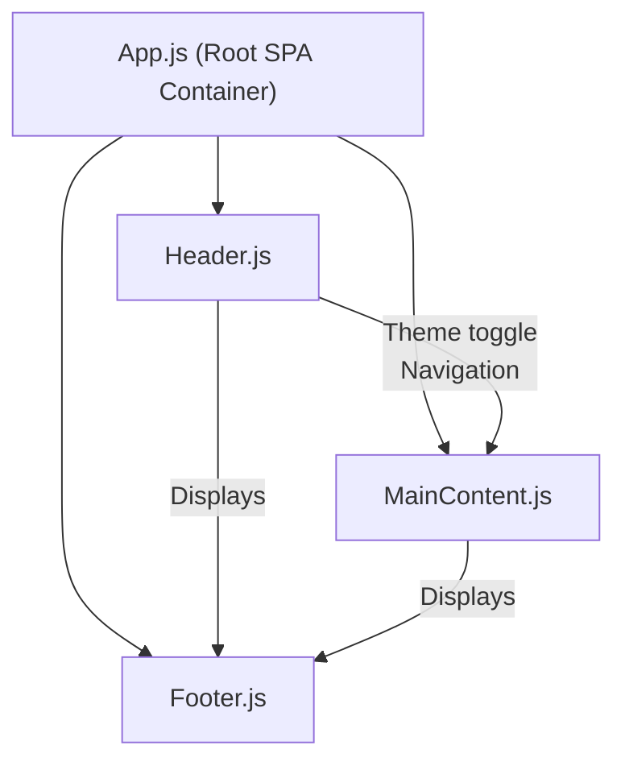

# React Frontend Project - High-Level Documentation

## Project Summary and Purpose

This project is a lightweight, modern web frontend built using React JS. Its primary purpose is to serve as a template or scalable starting point for building fast, maintainable, and visually appealing single-page applications (SPAs) with minimal dependencies. Emphasizing easy customization and brand theming, the application provides a cohesive UI experience with a responsive layout, built-in dark/light theming, and clear separation of layout components.

## Layout Overview

The application's layout is designed as a classic SPA with three main structural elements:

- **Header**: Contains the application logo, navigation menu, and a theme toggle button (light/dark).
- **Main Content Area**: Dynamically displays content depending on navigation (home, about, features, contact).
- **Footer**: Displays app copyright and version.

Layout is realized with React functional components and uses CSS Flexbox for responsive, column-oriented stacking. The styling ensures visual consistency across mobile and desktop displays.

```
        +----------------------+
        |       Header         |
        +----------------------+
        |    Main Content      |
        +----------------------+
        |       Footer         |
        +----------------------+
```

## Main Features and UI Components

### Core Features

- **Responsive Design**: Adjusts layout for mobile, tablet, and desktop screens.
- **Navigation**: Header includes navigation links to Home, About, Features, and Contact sections; navigation updates the central content area (SPA behavior).
- **Theming**: Supports toggling between light and dark themes via a dedicated button in the Header.
- **Accessible Markup**: Uses semantic HTML and ARIA labels for better accessibility.
- **Minimal Dependencies**: No external UI frameworks; all UI is custom-coded with CSS modules and CSS variables.

### Main UI Components

- **Header** (`src/components/Header.js`):  
  - Logo/title area.
  - Navigation button group.
  - Theme toggle button (🌙/☀️).
  - Displays API Base URL (from config or environment).
- **MainContent** (`src/components/MainContent.js`):  
  - Dynamically displays content per selected menu item.
  - Home, About, Features (listing SPA capabilities), and Contact sections.
- **Footer** (`src/components/Footer.js`):  
  - Displays copyright.
  - Version indicator using env variable (`REACT_APP_VERSION`).

### Theming and Styling Details

- **CSS Variables**:  
  Defined in `src/App.css`, variables power the color palette and adapt between themes.
  - Brand Colors:  
      - `--primary-color`: #007bff (blue)
      - `--secondary-color`: #6c757d (gray)
      - `--accent-color`: #ffc107 (orange/yellow)
  - Theming Variables:  
      - Backgrounds: `--bg-primary`, `--bg-secondary`
      - Text: `--text-primary`, `--text-secondary`
      - Buttons: `--button-bg`, `--button-text`
- **Theme Toggle**:  
  The theme switch adds a `data-theme="dark"` attribute to `<html>`, activating CSS overrides for dark mode.
- **Component CSS**:  
  Each main component has its own CSS file (`Header.css`, `Footer.css`, `MainContent.css`) imported into the JavaScript file.
- **Responsiveness**:  
  CSS includes media queries for optimal layout and control spacing on small screens.

## Architecture and Technology Stack

- **React Version**: ^18.2.0
- **Platform**: Web SPA (single-page application)
- **Bundler**: react-scripts (via Create React App)
- **CSS**: Native CSS Modules, leveraging CSS variables for theme adaptability.
- **Testing**: Jest and React Testing Library (`App.test.js` and `setupTests.js`).
- **Linting**: ESLint with recommended React and JS rules, customized via `eslint.config.mjs`.

### Component Overview



**Data Flow**:  
- The current page and theme state are managed in `App.js` and passed as props to child components.
- Navigation triggers (`onNav`) update the visible section in the main content.
- Theme toggling updates a state value, triggering a CSS theme switch.

## Folder Structure Description

```
frontend_react_js/
├── README.md
├── eslint.config.mjs
├── package.json
├── post_process_status.lock
├── src/
│   ├── App.css
│   ├── App.js
│   ├── App.test.js
│   ├── index.css
│   ├── index.js
│   ├── logo.svg
│   ├── setupTests.js
│   └── components/
│       ├── Footer.css
│       ├── Footer.js
│       ├── Header.css
│       ├── Header.js
│       ├── MainContent.css
│       └── MainContent.js
└── kavia-docs/
    └── PROJECT_OVERVIEW.md  (this file)
```

- **src/**: Contains all application source code.
  - **components/**: Reusable presentational components (Header, MainContent, Footer).
  - `App.js`: Wires together the page structure, themes, and navigation logic.
  - `App.css`: Provides global and theming styles.
- **public/**: Standard create-react-app public assets (not shown above).
- **package.json**: Manages dependencies and scripts.
- **eslint.config.mjs**: JavaScript/React linting configuration.

## How to Start/Develop the App

1. **Install dependencies**  
   From the `frontend_react_js` directory:
   ```
   npm install
   ```
2. **Start development server**  
   ```
   npm start
   ```
   Open your browser to [http://localhost:3000](http://localhost:3000) to view the running app.

3. **Run tests**  
   ```
   npm test
   ```
   Runs the test suite in interactive watch mode.

4. **Build for production**  
   ```
   npm run build
   ```
   Creates an optimized production build in the `build` directory.

5. **Customize colors/themes**  
   Edit CSS variables in `src/App.css` or add more override selectors as necessary.

6. **Add features**  
   Duplicate or extend components in `src/components/` and update navigation logic in `App.js` for extra pages/routes.

## Additional Notes

- **Environment Variables**:  
  You can define app version and API endpoint customizations in a `.env` file at the project root:
    - `REACT_APP_VERSION` (shown in the footer)
    - `REACT_APP_API_BASE_URL` (shown in the header for reference)
- **Deployment**:  
  Follows standard Create React App static build deployment. See [Create React App deployment guide](https://facebook.github.io/create-react-app/docs/deployment) for more details.
- **Extending Functionality**:  
  The template is intentionally minimal, offering a clear and adaptable foundation for adding more complex logic, external libraries, or advanced UI as required.

---

© {year} MyApp – Built with React and KAVIA template.
